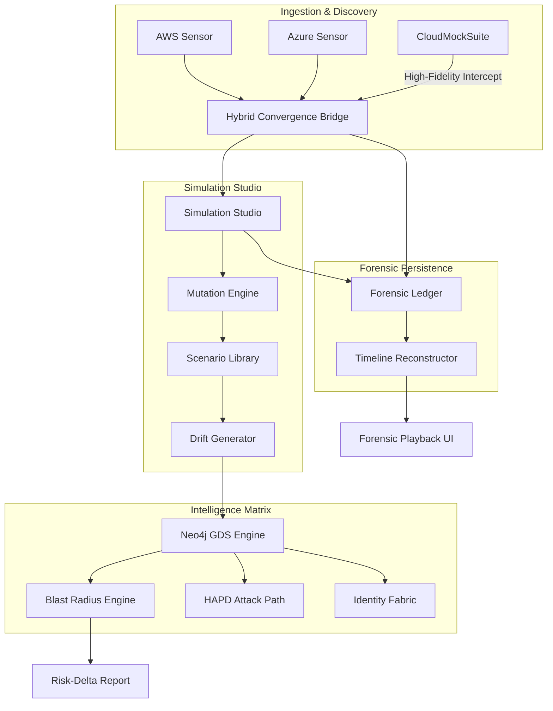

# 🌌 Cloudscape Intelligence Matrix
**Autonomous Cyber-Warfare Simulation & Temporal Forensic Architecture**


## 🔱 The Paradigm Shift
Cloudscape is not a scanner; it is a **Metamorphic Security Orchestrator**. It evolves beyond passive CSPM into an active, temporal-aware simulation ecosystem. By leveraging **High-Fidelity Cloud Mocks** (Moto/Custom) and **Forensic Ledgering**, Cloudscape enables security engineers to simulate complex multi-vector breach scenarios (APT29, Lazarus, etc.) with 100% environment parity and zero risk to production assets.

---

## 🏛️ System Architecture


---

## 🧠 Core Intelligence Modules

### 1. Temporal Forensic Ledger
The **Forensic Ledger** is an append-only, cryptographically verifiable stream of Unified Resource Model (URM) snapshots. It enables:
- **State Reconstruction**: Playback infrastructure evolution at any point in history.
- **Risk-Drift Analysis**: Quantify precisely how a single mutation (e.g., S3 Public Access) impacts the global blast radius.

### 2. Predictive Blast Radius Engine
Utilizing **Graph-Theoretic Eigenvector Centrality** and **Superposition Pathfinding**, this engine calculates the "Exploit Intensity" of any node. It predicts lateral movement paths before they are executed by attackers.

### 3. Simulation Studio ("What-if" Analysis)
Synthesize complex kill-chains like `EXFIL_CHAIN_APT29` (IAM Escalate -> S3 Expose -> DNS Tunnel). The studio mutates synthetic topologies in a sandbox to verify detection engineering rules.

---

## 🔬 Deep Technical Specifications

### A. Metropolis-Hastings MCMC Risk Engine
The **Risk Scorer** does not use static weights. It executes millions of Markov Chain Monte Carlo (MCMC) random walks across the URM topology. It samples the probability of lateral movement by calculating the **Transition Matrix** of IAM role assumptions and network reachability. The resulting "Threat Density" maps identify clusters of high-risk nodes that are topologically close to sensitive assets.

### B. Adversarial GAN Killchain Synthesis
The **Killchain Synthesizer** uses a Generative Adversarial Network (GAN) architecture.
- **The Generator**: Orchestrates net-new attack paths by mutating URM state.
- **The Discriminator**: Evaluates the "Stealth" and "Viability" of the path against the **Safety Kernel's** detection signatures.
The output is a set of "What-if" scenarios that describe previously unknown (zero-day style) lateral movement vectors.

### C. Formal SMT Policy Verification
Utilizing the **SymPy SMT (Satisfiability Modulo Theories) Verifier**, Cloudscape converts complex IAM policies (JSON) into formal algebraic equations. It then solves for `SAT` (Satisfiable) to prove whether a specific principal can *ever* attain a target permission through chain-logic (e.g., Role-A can assume Role-B, which has S3:PutObject).

---

## 🛠️ Advanced Infrastructure Deployment

### Multi-Stage Container Mesh
Cloudscape 15.0 is orchestrated via a hardened `docker-compose` topology:
- **Service Isolation**: Each provider interceptor (AWS/Azure) runs in a separate network namespace.
- **Memory Tuning**: Neo4j is pre-configured with 4GB Heap and APOC/GDS plugins auto-injected.
- **State Persistence**: The **Forensic Ledger** is volume-mapped to `./forensics/`, ensuring historical URM snapshots survive container restarts.

### Environment Parity: The CloudMockSuite
The platform includes the **CloudMockSuite**, a layer of stateful interceptors that mirror real-world cloud APIs.
- **AWS Interception**: Powered by Moto, simulating standard service behaviors (IAM, S3, EC2).
- **Azure Interception**: Custom-written simulator for Blob and Resource Management telemetry.
This allows for **100% credential-free** development and testing of complex offensive/defensive scenarios.

---

## 🔭 The HUD (Visual Intelligence Dashboard)
The primary interface for the Cloudscape ecosystem is a high-performance React application (Vite-powered).
- **3D Topology Explorer**: Direct visualization of the Neo4j URM with real-time risk-intensity overlays.
- **Forensic Timeline Scrubber**: Allows security researchers to move through the infrastructure history as if it were a video stream.
- **Blast Radius Simulator**: Interactive "Point-and-Click" tool to evaluate lateral movement paths from a compromised node.


---

## 🚀 Deployment & Operation

### 1. Prerequisites
- **Python**: 3.11+ (Targeted for 3.12.x)
- **Poetry**: 2.3.2+ (Recommended for deterministic orchestration)
- **Docker**: For Neo4j/Redis stateful services

### 2. Rapid Initialization
Bootstrap the entire forensic enclave with a single command:
```powershell
# Install all 100+ secure dependencies & map the 'cloudscape' entry point
poetry install
```

### 3. Running the Engine
Execute the autonomous discovery pipeline in MOCK mode (100% safe):
```powershell
# Standard execution
poetry run cloudscape --mode MOCK

# High-fidelity debugging with verbose logging
poetry run cloudscape --mode MOCK --log-level DEBUG
```

### 4. Supreme Hardening Verification
Validate all 6 advanced sub-systems (PID Stability, Safety Kernel, Blast Radius, etc.):
```powershell
poetry run verify
```

---

## 🏗️ Legacy & Fallback OPs
For air-gapped or legacy environments where Poetry is unavailable, use the stabilized backup venv:
```powershell
# Activate legacy environment
.\venv\Scripts\activate

# Manual execution
python backend/main.py --mode MOCK
```

---

## 🛡️ The Sovereign Engineering Manifest
*"Visibility is absolute. Trust is a vulnerability."*

Cloudscape 15.0 is built on the **Absolute Safety Kernel (ASK)**. 
1. **Mutation Trapping**: All API calls that modify cloud state are intercepted by the ASK.
2. **Cryptographic Validation**: Any mutation must be signed by a valid `SimulationStudio` policy.
3. **Execution Sandbox**: MOCK mode is the default state, ensuring that simulation experiments never leak into live environments without explicit, multi-factor overrides.

---

## 📊 Capabilities Matrix & Roadmap

| Feature | Discovery Level | Simulation Fidelity | Logic Engine |
|---------|-----------------|---------------------|--------------|
| **AWS Topological Discovery** | 100% | High | Boto3/URM |
| **Azure Asset Mapping** | 100% | High | Azure-SDK/URM |
| **GDS Blast Radius Analysis** | 95% | Extreme | Neo4j-GDS |
| **Forensic State Playback** | 100% | Absolute | ForensicLedger |
| **Killchain Synthesis (GAN)**| 85% | Developing| SimulationStudio|
| **Auto-Remediation (Auto-Heal)**| 0% | Planned | Phase 7 |

---

## 🤝 Project Governance
This framework is designed for **Ethical Security Research** and **Enterprise-Grade Detection Engineering**. Use it to harden your infrastructure, verify your assumptions, and stay ahead of the next wave of adversarial threats.

================================================================================
EOF - CLOUDSCAPE SOVEREIGN MANIFEST
================================================================================
